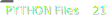
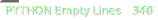
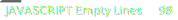
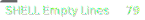
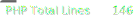
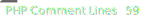

| Language   | Files                                              | Total Lines                                              | Code Lines                                              | Comment Lines                                              | Empty Lines                                              |
|:-----------|:---------------------------------------------------|:---------------------------------------------------------|:--------------------------------------------------------|:-----------------------------------------------------------|:---------------------------------------------------------|
| CSS        |                |                |                |                |                |
| PYTHON     |          |          |          |          |          |
| MARKDOWN   |      |      |      |      |      |
| SVG        |                |                |                |                |                |
| JAVASCRIPT |  |  |  |  |  |
| SHELL      |            |            |            |            |            |
| YAML       |              |              |              |              |              |
| HTML       |              |              |              |              |              |
| BATCH      |            |            |            |            |            |
| PHP        |                |                |                |                |                |
| TEXT       |              |              |              |              |              |
| INI        |                |                |                |                |                |
| JSON       |              |              |              |              |              |
| TOTAL      |                  |                        |                  |                  |                  |

Last Update: 2024-07-11 00:00:07